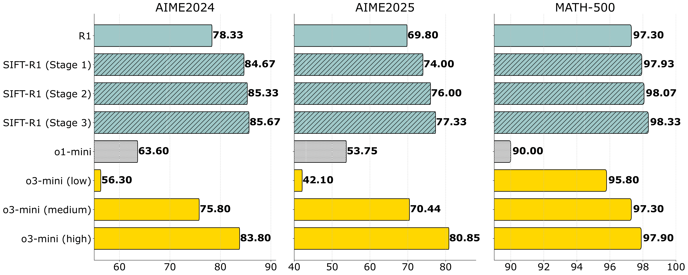

  

#  SIFT

### SIFT: Grounding LLM Reasoning in Contexts via Stickers

<!-- Authors and affiliations with improved formatting -->
Zihao Zeng, Xuyao Huang*, Boxiu Li*, Zhijie Deng† 

Shanghai Jiao Tong University
 
{zengzihao, huangxuyao, lbxhaixing154, zhijied}@sjtu.edu.cn
 
*Equal contribution. &nbsp; †Corresponding author.
 

 

## 🧐 What is SIFT?
**SIFT** is a novel post-training approach designed to improve the reasoning accuracy of large language models (LLMs) by mitigating context misinterpretation issues. It introduces the Sticker, a self-generated highlight that emphasizes key contextual information, ensuring more precise reasoning. SIFT refines predictions by comparing responses with and without the Sticker, using forward optimization and inverse generation to align facts with queries. Experiments across diverse models (3B to 100B+) and benchmarks (e.g., GSM8K, MATH-500) show consistent performance gains. Notably, SIFT boosts DeepSeek-R1’s pass@1 accuracy on AIME2024 from 78.33% to 85.67%, setting a new state-of-the-art in open-source LLMs.

 

  <!-- Slightly smaller image, adjust width as needed -->

 

## 🛠️ Environment Setup ⚙️

### **Installation Opencompass 🚀**

Our testing is based on Opencompass (version 0.3.4). For installation and usage instructions, refer to [Opencompass GitHub](https://github.com/open-compass/opencompass).

### **Dataset 📂**
Put your data in `/opencompass/data/gsm8k/test.jsonl`.

### **Preparation Steps 🔧**

#### **File Replacements 🔄**
Replace the following files with the provided ones:
- 🔹 Replace `/opencompass/models/huggingface_above_v4_33.py` with `huggingface_above_v4_33.py`.
- 🔹 Replace `/opencompass/openicl/icl_inferencer/icl_gen_inferencer.py` with `icl_gen_inferencer.py`.
- 🔹 Replace `/opencompass/openicl/icl_inferencer/icl_base_inferencer.py` with `icl_base_inferencer.py`.

#### **Add Dataset Configurations 📑**
Copy the following files into `/opencompass/configs/datasets/gsm8k`:
-  `gsm8k_a2p.py`
-  `gsm8k_p2a.py`
-  `gsm8k_q_a2a.py`
-  `gsm8k_q_a2p.py`
-  `gsm8k_q2a.py`
-  `gsm8k_q2p.py`

#### **Add Additional Files 📂**
Copy the following files into `/opencompass`:
-  `acc_stage2.py`
-  `acc_stage3.py`
-  `acc_stage4.py`
-  `abs_postprocessing.py`
-  `abs_postprocessing_v2.py`
-  `abs_postprocessing_v3.py`
-  `eval_3b.sh`

✅ These steps ensure the correct setup of the environment and necessary configurations for Opencompass.

